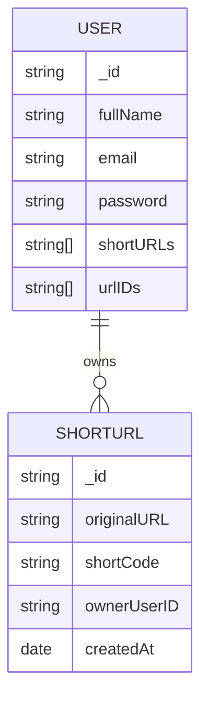
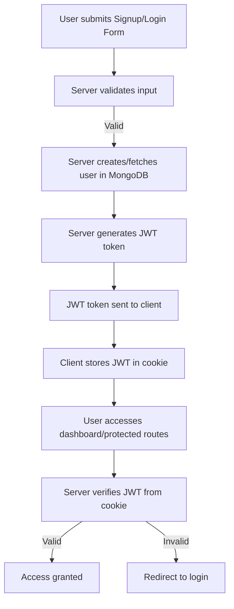

# 🚀 URL Shortener with Authentication

A modern, full-featured URL Shortener application with robust user authentication, built using **MongoDB**, **JWT tokens**, and **cookie-based session management**. Users can sign up, log in, and manage their collection of short URLs through a personalized dashboard.

---

## 📚 Index

1. [Overview](#overview)
2. [Features](#features)
3. [Technical Stack](#technical-stack)
4. [Usage Guide](#usage-guide)
   - [Signup](#signup)
   - [Login](#login)
   - [Dashboard](#dashboard)
5. [Authentication & Session Flow](#authentication--session-flow)
    - [Signup Flow](#signup-flow)
    - [Login Flow](#login-flow)
    - [Token Verification](#token-verification)
6. [Architecture & Data Flow](#architecture--data-flow)
    - [Class & Entity Relationships](#class--entity-relationships)
    - [Authentication Flow Diagram](#authentication-flow-diagram)
7. [Screenshots](#screenshots)
8. [Security Considerations](#security-considerations)
9. [Extension Ideas](#extension-ideas)

---

## ⚡️ Overview

This project is a secure and user-friendly **URL shortener** that provides:

- **User authentication** (signup/login)
- **Session management** via cookies and JWTs
- **Personalized dashboards** for managing short URLs
- **Database-backed** storage of users and URLs

> All user data and sessions are securely separated.

---

## ✨ Features

| Feature                  | Description                                                                 |
|--------------------------|-----------------------------------------------------------------------------|
| **User Authentication**  | Secure login and signup with MongoDB user storage                           |
| **JWT Tokens**           | Session management using JSON Web Tokens                                    |
| **Cookie Storage**       | Secure session persistence through browser cookies                          |
| **Short URL Management** | Create, view, and manage your own short URLs                                |
| **Personalized Dashboard** | See a history of your requests and manage your URLs                        |
| **Session Isolation**    | Each user’s data is protected and isolated via tokens and cookies           |

---

## 🛠️ Technical Stack

- **Backend**: Node.js (assumed), Express.js (common for such setups)
- **Database**: MongoDB
- **Authentication**: JWT tokens (using `jsonwebtoken`), Cookie storage
- **Frontend**: Not specified, but screenshots suggest a web-based UI

---

## 📝 Usage Guide

### 1. Signup

1. Navigate to the **Signup page**
2. Enter your **Full Name, Email, and Password**
3. Submit the form to create your account

### 2. Login

1. Navigate to the **Login page**
2. Enter your **Email and Password**
3. Submit the form
4. Upon success, you’ll be redirected to your **Dashboard**

### 3. Dashboard

- After login, see a dashboard with your previous URL requests
- Create new short URLs
- View and manage your existing short URLs

---

## 🔒 Authentication & Session Flow

### JWT Tokens

- Used to securely transmit information between client and server
- Created and verified using the `jsonwebtoken` library
- Token payload includes **user ID** and **email**
- Signed with a secret key (`process.env.JWT_SECRET`)

### Cookies

- JWT token is stored in a **browser cookie**
- Keeps users logged in after page refresh
- Each session uses a unique cookie/token

---

## 🔑 Authentication Flow

### Signup Flow

1. User submits signup form
2. Server validates and creates a new user in MongoDB
3. A JWT token is generated for the user
4. Token returned to client, stored in a cookie in the browser

### Login Flow

1. User submits login form
2. Server validates credentials and retrieves user from MongoDB
3. New JWT token generated
4. Token sent to client, stored in cookie

### Token Verification

- For protected routes, server checks the JWT token from the cookie
- If valid, access is granted; if invalid/expired, user is redirected to login

---

## 🗂️ Architecture & Data Flow

### Class & Entity Relationships

### Authentication Flow Diagram

---

## 🖼️ Screenshots

|Signup Page
 
  Dashboard    Short URL Management    Logged-in State

---

## 🛡️ Security Considerations

- **Password Hashing:** (Assumed) User passwords should be hashed before storage.
- **Token Expiry:** JWTs should include an expiration time to limit session lifetime.
- **Cookie Flags:** Cookies should be set with `HttpOnly` and `Secure` flags.
- **Input Validation:** All user input must be validated and sanitized to prevent injection attacks.

---

## 💡 Extension Ideas

- Add support for **custom short codes** and link expiration
- Add **email verification** for signup
- Include **analytics** for URL visits
- Implement **OAuth2** login (Google, GitHub, etc.)
- Provide a **public API** for URL shortening

---

## 📬 Questions or Contributions?

Feel free to open an issue or pull request. Happy shortening! 🚀

---

> **Note:** This documentation is based on the provided README. For detailed API, controller, or route documentation, please provide the server-side code files.
